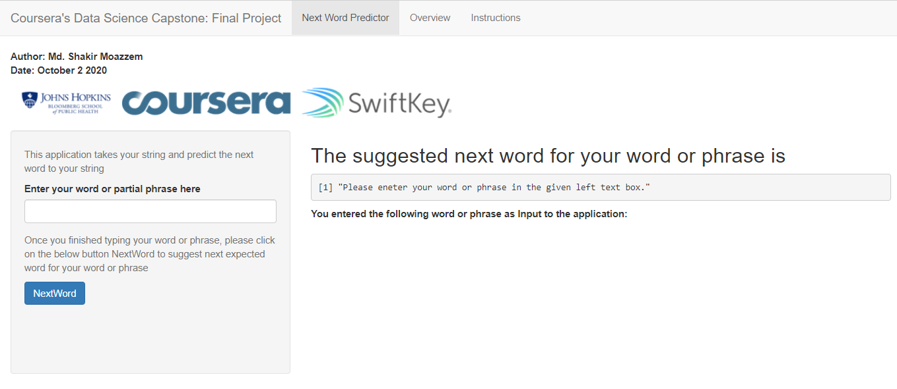

Data Science Capstone: Predicting the Next Word
========================================================
author: Md. Shakir Moazzem
date:  October 2, 2020
autosize: true
transition: rotate
transition-speed: slow
incremental: true
font-import: http://fonts.googleapis.com/css?family=Helvetica
font-family: 'Helvetica'

Overview of the Project
========================================================
<small> The purpose of the project is to create text-prediction application with R Shiny package that predicts words using a natural language processing model i.e. creating an application based on a predictive model for text.</small> 

<small> Given a word or phrase as input, the application will try to predict the next word, similar to the way most smart phone keyboards are implemented today using the technology of *Swiftkey*.</small>

<small>The predictive model will be trained using a corpus, a collection of written texts, called the **HC Corpora** which has been filtered by language.</small>

<small>The application is available at the following link:
<a href="https://shakir-sust.shinyapps.io/wordPredictorApp/" target="_blank">Shiny App</a>.</small>

Overview of the Prediction Model
========================================================

<small>The prediction model uses the principles of **tidy data** applied to text mining in R. The following Key steps are involved in the prediction model.</small>

<small>* As an input, it takes raw text files for model training
* Clean the raw data; separate into 2, 3, 4, 5, and 6 word n grams and save as tibbles
* Sort the n grams tibbles by frequency and save the data as *.rds* files
* N grams function uses a **back-off** type prediction model
      - User supplies an input phrase
      - Model uses last 5, 4, 3, 2, or 1 words to predict the best 6th, 5th, 4th, 3rd, or 2nd   match in the data
* As an output, it predicts next word</small>

Next Word Predictor App
========================================================
left: 55%
incremental: true

<small>
The above image describes how the app functions and its instructions. 

***
<small>
**Overview:** The Next Word Predictor app provides a simple user interface to the next word prediction model. The app takes as input a phrase (multiple words) in a text box input and outputs a prediction of the next word. </small> 

The Shiny app dashboard:
* Offers an intuitive and simple graphical user interface 
* Can easily be adapted for educational and commercial uses.</small>

Thanks!
========================================================
incremental: false

<a href="https://shakir-sust.shinyapps.io/wordPredictorApp/" target="_blank">Click here to see the Shiny App </a>

**References**
<small>
* [Tidy Data](http://vita.had.co.nz/papers/tidy-data.html)

* [Text Mining with R: A Tidy Approach](http://tidytextmining.com/index.html)

* [Next Word Predictor App](https://shakir-sust.shinyapps.io/wordPredictorApp/)

Thorsten Brants, Ashok C. Popat, Peng Xu, Franz J. Och, Jeffrey Dean. (2007), Large language
models in machine translation. In Proceedings of the 2007 Joint Conference on Empirical Methods
in Natural Language Processing and Computational Language Learning, pages 858-867.</small> 
